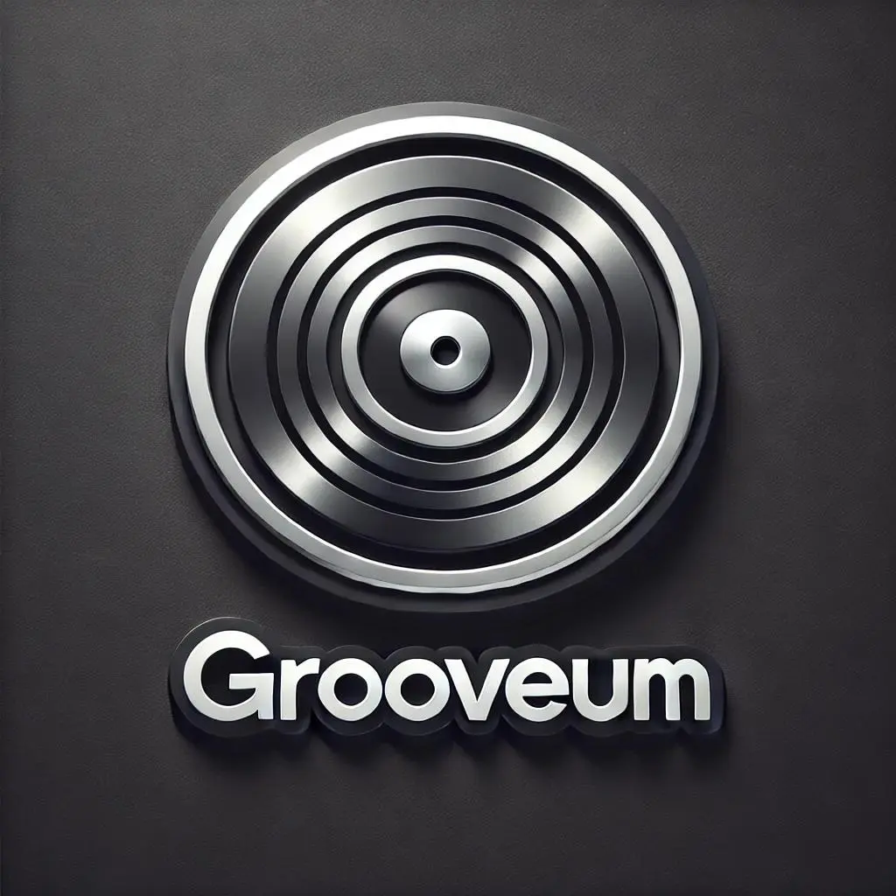
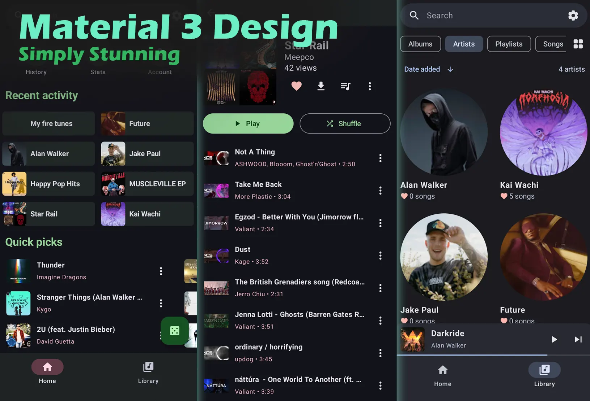
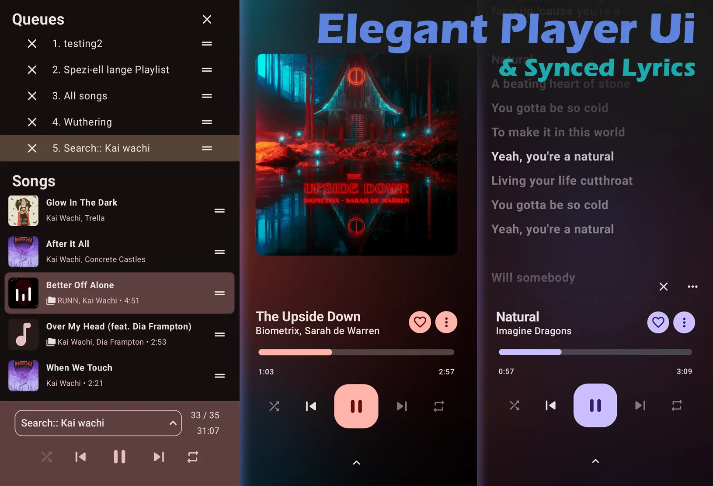
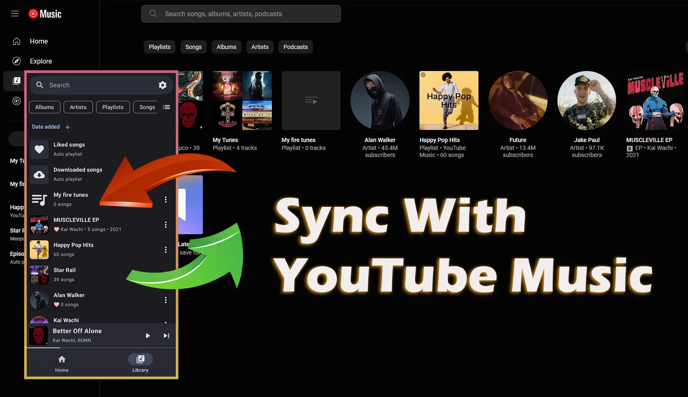

# **Grooveum**

A Material 3 YouTube Music client & local music player for Android

### Features

Grooveum is a feature-rich, Material 3-powered YouTube Music client and local music player designed to elevate your music experience with a sleek UI, powerful playback features, and seamless YouTube Music integration.

🎵 Stream and manage music from YouTube Music

Download songs for offline listening

Background playback with no ads

🎧 Enhanced local music support

Play local and YouTube Music songs together

Improved metadata parsing (e.g., correct tag handling for \\)

🔄 Advanced sync features

Sign in with your YouTube Music account

Sync songs, albums, and subscriptions between device and account

Playlist syncing is coming soon

🎚️ Audio customization

Tempo, pitch, and normalization control

Audio effects for a personalized experience

🚗 Android Auto support

🎤 LRC lyric sync

Supports multi-line and time-synced lyrics

🔀 Multiple queues

Seamless queue management and switching

### **Screenshots**

✨ Material 3 design

Clean, modern, and responsive interface with dynamic color support

        

#### [!WARNING]

Grooveum requires YouTube Music to be supported in your region. Use a VPN or proxy if YTM isn’t available in your country.

#### FAQ

Q: How do I scrobble music to LastFM, LibreFM, ListenBrainz, or GNU FM?
You can use third-party scrobbling apps like Pano Scrobbler.

Q: Grooveum doesn’t show in Android Auto?
Go to Android Auto settings.

Tap the version number multiple times to unlock Developer Mode.

Open "Developer settings" from the three-dot menu.

Enable "Unknown sources."

#### Building & Contributing

We welcome all contributors! Whether you're a developer, designer, or translator — your help is valuable.

See the CONTRIBUTING.md for build instructions and contribution guidelines.

#### Attribution

Developed and maintained by Aryan Saxena

Connect with me on LinkedIn

Special thanks to all contributors! Check them out here

#### Disclaimer

Grooveum is not affiliated with YouTube, Google LLC, or any of their subsidiaries.

All trademarks and intellectual property rights belong to their respective owners.
